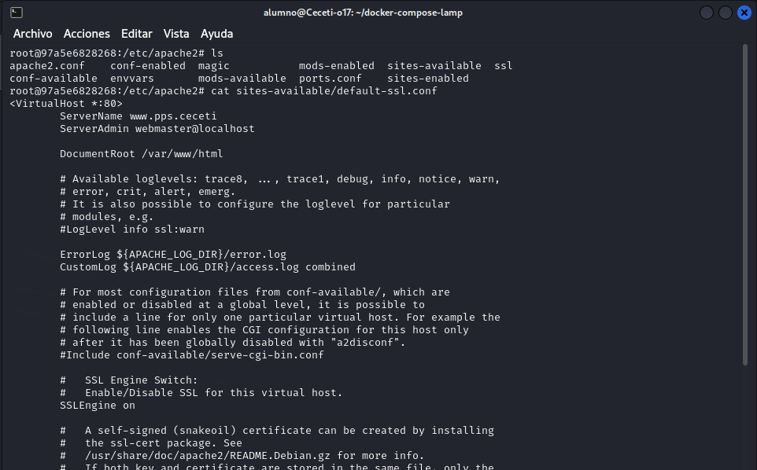
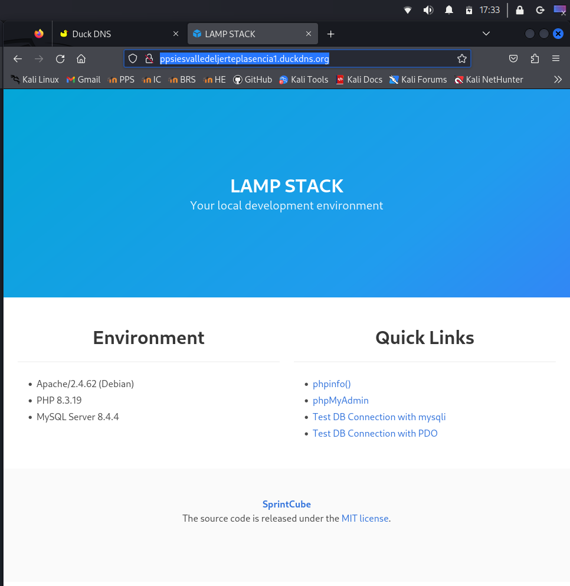

# PPS-Unidad3Actividad13-HardeningSevidorApache-HTTPS-HSTS-
HTTPS, Hsts, Hardening de servidor web.


Tenemos como objetivo:


- Conocer cómo configurar un servidor Apache.

- Conocer el funcionamiento de HTTP y HTTPS.

- Crear certificados en nuestro servidor.

- Saber configurar nuestro servidor para utilizar HTTPS.

- Conocer HTST.

- Utilizar configuracion segura en servidores y aplicaciones web.

- Conocer los Firewall de aplicaciones (WAF)


# ACTIVIDADES

## 1. Instalación de Apache

Cómo estamos utilizando un escenario docker-compose, para acceder a nuestra máquina tendremos que ejecutar:

```
docker exec -it lamp-php83 /bin/bash
```

Nuestro contenedor que contiene el servicio web, como ves se llama lamp-php83. Si la carpeta donde tienes el escenario tiene otro nombre diferente de lamp, tendrás que cambiar el nombre.

En nuestro servidor ya tenemos instalado Apache, no obstante en cualquier máquina Linux, podemos instalar un servidor Apache, instalando el paquete `apache2`.

```
apt update
apt install apache2
```

Si no estás utilizando el entorno de pruebas sino otra máquina no estás con usuario `root`es posible que tengas que poner delante de los comandos `sudo`.

---
 
## 2. Estructura de directorios de configuración Apache

El directorio donde nos encontraremos los archivos de configuración de Apache es `/etc/apache2`. Allí encontraremos los siguientes directorios de configuración que incluyen archivos de configuración (con extensión .conf). 

       /etc/apache2/
       |-- apache2.conf
       |       `--  ports.conf
       |-- mods-enabled
       |       |-- *.load
       |       `-- *.conf
       |-- conf-enabled
       |       `-- *.conf
       `-- sites-enabled
       |        `-- *.conf
       `-- sites-available
               `-- *.conf

El archivo de configuración global es `/etc/apache2/apache2.conf`. En él podemos leer detalladamente la configuración explicada.

Los `Modulos` son módulos o archivos, que aportan una funcionalidad específica al servidor Apache. Por ejemplo el módulo `ssl.conf` nos sirve para utilizar el protocolo ssl en apache y así utilizar https.

Tenemos el directorio `/etc/apache2/mods-available` donde podemos encontrar todos los módulos disponibles para nuestro servidor (estén o no operativos).

En el directorio `/etc/apache2/mods-enabled` están los módulos que tenemos instalados, o habilitados, es decir los que queremos que nos añadan funcionalidad a apache.

Podemos ver los módulos que tenemos instalados con el comando `apache2ctl -t -D DUMP_MODULES`.


Para añadir la funcionalidad de un módulo a nuestro servidor Apache, utilizamos `a2enmod nombre_modulo`(a2enmod:Apache2 enable module). Por ejemplo para habilitar el módulo ssl utilizaríamos `a2enmod ssl`.

Para deshabilitar la funcionalidad de un módulo lo desinstalamos con `a2dismod nombre_modulo`(a2dismod: Apache2 disable module).

Al igual que con los __módulos__ tenemos dos directorios con los archivos de configuración de los __Sitios__ o __Servidores Web__ que tenemos: 

- En `/etc/apache2/sites-available` tenemos los archivos de configuración de los diferentes sitios o Servidores web disponibles, independientemente de que se hayan habilitado o no.

- En `/etc/apache2/sites-enabled`tenemos los archivos de configuración de los sitios o servidores Web habilitados. 

Para habilitar un sitio utilizamos el comando `a2ensite Archivo.conf`. Siendo Archivo.conf la configuración del sitio guardada en el directorio `/etc/apache2/sites-available/`.

Cuando habilitamos un directorio con `a2ensite`(Apache2 enable site), se crea un enlace que apunta al archivo de configuración situado en `/etc/apache2/sites-available`.


---

## 3. Sitios Virtuales

Para crear un sitio virtual, como podemos intuir, creamos un archivo o modificamos alguno de los archivos existentes en  `/etc/apache2/sites-available`.

Vamos a modificar el  archivo`/etc/apache2/sites-available/000-default.conf`. Lo dejamos con este contenido:
```
<VirtualHost *:80>

        ServerName www.pps.ceceti
	ServerAdmin webmaster@localhost
        DocumentRoot /var/www/html

        ErrorLog ${APACHE_LOG_DIR}/error.log
        CustomLog ${APACHE_LOG_DIR}/access.log combined

</VirtualHost>

```

Donde podemos ver que encontramos las diferentes variable:

- __ServerName__ va a almacenar el nombre de nuestro `host virtual`o `servidor virtual`. Observa que el nombre de nuestro sitio es www.pps.ceceti.

- En __ServerAdmin__ ponemos el correo electrónico del administrador.

- __DocumentRoot__ contiene el directorio donde van a estar ubicados los archivos a mostrar en dicho servidor (html, php, etc...)

- Aun que no obligatorio, vemos que  En `ErrorLog` y `CustomLog`podemos indicarles los directorios donde se almacenarán los logs. En este caso van en combinación con la variable de docker `${APACHE_LOG_DIR)` que en nuestro servidor es `/var/log/apache2`.


Una vez creado el archivo de configuración del sitio, lo habilitamos con:

```
a2ensite /etc/apache2/sites-available/000-default.conf
```

__Permisos y propietarios de Directorios de sitios virtuales__

Es muy importante establecer los permisos de los directorios correctamente o puedes encontrarte un error de que no se puede acceder a los archivos del directorio virtual.ç

Cuando un cliente hace una petición a un recurso de nuestro servidor lo hace como un usuario sin autenticar en el sistema, y apache actúa de su parte intentando acceder a dicho recurso con sus credenciales propias, que suelen ser usuario www-data y grupo www-data.

Por lo tanto, suponiendo que no necesitemos subir archivos a nuestro servidor web, para establecer los propietarios y permisos oportunos a los archivos virtuales de nuestro sitio que se encuentran en `/var/www/html` hacemos:

```
chown -R www-data:www-data /var/www/html/*
chmod -R 755 /var/www/html/*
```

---

## 4. Resolución local de nombres: dns o fichero __/etc/hosts__

Nuestro navegador resuleve la dirección www.google.com o cualquier otra asociándole la ip donde se encuentra en el servidor, eso es debido a la resolución de servidores dns.

En el caso de nuestros sitios virtuales, si no están incluidos en los servidores dns, para hacer pruebas en nuestro ordenador, hemos de modificar las rutas en nuestro equipo para que pueda asociar estos nombres (ficticios) con la ip local. 

Debemos editar el fichero hosts para que nos devuelva la dirección del bucle local (127.0.0.1) cuando el navegador pida la url www.pps.net o cualquier otra asociada con un host virtual.

Este fichero está en /etc/hosts.

En los casos asociamos los nombres de los host virtuales a localhost tal y como se muestra en las siguientes capturas, además en el archivo `/etc/hosts` vemos cómo dirección de nuestro servidor apache. En nuestro caso `172.20.0.5`:

Máquina host:


Contenedor docker: 


__Reiniciar el servicio Apache__

Después de hacer cambios en la configuración de nuestro servidor, si queremos que estos cambios se apliquen, necesitamos recargar la configuración con:

```
service apache2 reload
```

Ya podemos acceder a nuestro servidor desde:

```
http://www.pps.ceceti/
```


---

## 5. Creación de un servidor virtual __Hackker__

Vamos a crear un servidor virtual nuevo para alojar los archivos maliciosos. El directorio estará en `/var/www/hacker` y el nombre del servidor será `www.hacker.ceceti`

Dentro de este directorio crear una página básica index.html. Puedes descargarte [éste.](./files/index.html)

Creamos directorio, copiamos el archivo y establecemos permisos y propietarios. Finalmente habilitamos sitio y recargamos servicio:

```
mkdir /var/www/hacker 
cp /var/www/html/index.html /var/www/hacker/index.html
chown -R www-data:www-data /var/www/hacker
chmod -R 755 /var/www/hacker
a2ensite /etc/apache2/sites-available/hacker.conf
service apache2 reload
```

Finalmente creamos el archivo de configuración del sitio:

```
<VirtualHost *:80>

    ServerName www.hacker.ceceti

    ServerAdmin webmaster@localhost
    DocumentRoot /var/www/hacker

    ErrorLog ${APACHE_LOG_DIR}/error.log
    CustomLog ${APACHE_LOG_DIR}/access.log combined

</VirtualHost>

```

Accedemos desde `http://www.hacker.ceceti`


---

## 6. Cómo habilitar HTTPS con SSL/TLS en Servidor Apache

Para proteger nuestro servidor es crucial habilitar HTTPS en el servidor local. Veamos cómo podemos habilitarlo en Apache con dos métodos diferentes.


### Método 1: Habilitar HTTPS en Apache con __OpenSSL__

1. Generamos un certificado SSL autofirmado

Para entornos de prueba o desarrollo, se puede utilizar un __certificado autofirmado__, es decir, un certificado que no ha sido emitido por una entidad de certificación.


__Paso 1: Crear la clave privada y el certificado__
---

Como estamos trabajando bajo docker, accedemos al servidor:

```
docker exec -it lamp-php83 /bin/bash
```

Comprobamos que están creados los directorios donde se guardan los certificados y creamos el certificado autofirmado:

```
mkdir /etc/apache2/ssl
cd /etc/apache2/ssl
openssl req -x509 -nodes -days 365 -newkey rsa:2048 -keyout localhost.key -out localhost.crt
```

__Parámetros del comando__

- `req`: inicia la generación de una solicitud de certificado.
- `-x509`: crea un certificado autofirmado en lugar de una CSR.
- `-nodes`: omite el cifrado de la clave privada, evitando el uso de contraseña.
- `-newkey rsa:2048`: genera una nueva clave RSA de 2048 bits.
- `-keyout server.key`: nombre del archivo que contendrá la clave privada.
- `-out server.crt`: nombre del archivo de salida para el certificado.
- `-days 365`: el certificado será válido por 365 días.

Durante la ejecución del comando, se te solicitará que completes datos como país, nombre de organización, y nombre común (dominio).

Vemos como se han creado el certificado y la clave pública


__Paso 2.Configurar Apache para usar HTTPS__
---

Una vez que tengas el certificado y la clave privada, debes configurar Apache para utilizarlos.

Yo voy a cambiar el archivo de coniguración que uso. Por lo tanto:

- Deshabilitar el sitio que estaba utilizando:

```
a2dissite 000-default.conf
```


Editar el archivo de configuración de Apache `default-ssl.conf`:

```
nano /etc/apache2/sites-available/default-ssl.conf
```

Lo modificamos y dejamos así:

```
<VirtualHost *:80>

    ServerName www.pps.ceceti

    ServerAdmin webmaster@localhost
    DocumentRoot /var/www/html

    ErrorLog ${APACHE_LOG_DIR}/error.log
    CustomLog ${APACHE_LOG_DIR}/access.log combined

</VirtualHost>

<VirtualHost *:443>
    ServerName www.pps.ceceti

   //activar uso del motor de protocolo SSL 
    SSLEngine on
    SSLCertificateFile /etc/apache2/ssl/localhost.crt
    SSLCertificateKeyFile /etc/apache2/ssl/localhost.key

    DocumentRoot /var/www/html
</VirtualHost>
```




Date cuenta que hemos creado un __servidor virtual__ con nombre __www.pps.ceceti__. A partir de ahora tendremos que introducir en la barra de dirección del navegador `https://www.pps.ceceti` en vez de `https://localhost`.


__Paso3: Habilitar SSL y el sitio:__
---

En el servidor Apache, activamos __SSL__ mediante la habilitación de la configuración `default-ssl.conf`que hemos creado:

```
a2enmod ssl
a2ensite default-ssl.conf
service apache2 reload
```


__Paso 4: poner dirección en /etc/hosts o habilitar puerto 443__

Añadimos nuestro dominio en el archivo /etc/hosts de nuestra máquina anfitriona para que resulva bien los dns. [Lo tienes explicado en una sección anterior(## Resolución_de_ nombres:_dns_o_fichero___/etc/hosts__)

Ahora el servidor soportaría __HTTPS__. Accedemos al servidor en la siguiente dirección: `https://www.pps.ceceti`


### Método 2: Obtener Certificado en un servidor Linux usando Let's Encrypt y Certbot__

El objetivo de [Let’s Encrypt[(https://letsencrypt.org/es/how-it-works/) y el protocolo ACME es hacer posible configurar un servidor HTTPS y permitir que este genere automáticamente un certificado válido para navegadores, sin ninguna intervención humana. Esto se logra ejecutando un agente de administración de certificados en el servidor web.

#### Requisitos previos

Antes de empezar, debemos asegurarnos que:

- Tenemos acceso SSH como usuario root o con privilegios de sudo.

- El puerto 80 (HTTP) y 443 (HTTPS) están abiertos en el firewall.

- Tenemos un nombre de dominio registrado apuntando a la IP pública del servidor.

Hasta ahora hemos hecho todos los ejercicios en nuestro servidor local `localhost`. Si queremos obtener un certificado en Let`s Encrypt debemos de tener un dominio registrado.

Podemos obtener un dominio gratuito en webs como `duckdns.org` o `no-ip.org`. Vamos a crear uno

__Paso 1: Registrar un dominio a nuestro nombre__.

Normalmente es necesario adquirir un dominio para nuestra organización. Si embargo podemos obtener un dominio y asociarlo a una IP dinámica de forma gratuita.

En esta ocasión he elegido [Duck DNS](https://www.duckdns.org/).

- Iniciamos sesión con una cuenta de Gmail, github, etc.

- Introducimos el nombre de dominio que queremos y comprobamos que está disponible. Lógicamente, nuestro nombre de dominio será un subdominio de Duck DNS. En mi caso he generado `ppsiesvalledeljerteplasencia.duckdns.org`. Además la asociará con la dirección ip que detecta en ese momento. 


- Ahora que tenemos un nombre de dominio registrado, debemos modificar el `ServerName` del fichero de configuración de nuestro host virtual `/etc/apache2/sites-available/default-ssl.conf` o el fichero de configuración del host virtual que deseemos.


- Para poder acceder a ella tendremos que añadirla en nuestro ficherto /etc/hosts, y abrir posteriormente los puertos de nuestro router, pera ya lo veremos más adelante. Lógicamente, esto último no lo podemos hacer en nuestro centro, tendremos que limitarlo a hacerlo en su caso en nuestra casa.




Una vez registrado el dominio, procedemos con la obtención del certificado:

__Paso 2: Instalar Certbot__

```
apt update
apt install certbot python3-certbot-apache
```


__Paso 3: Obtener el certificado SSL__

```
certbot --apache
```


Durante el proceso:

- Se verificará que el dominio apunte correctamente al servidor.

- Se te pedirá un correo electrónico.

- Se te pedirá que aceptes la licencia.

- Se te pedirá permiso de uso de tu correo para fines de la organización.

- Si tienes creado los archivos de configuración de varios servidores, te pedirá que indiques para cuál o cuales de ellos lo quieres. 

- Se te preguntará si deseas redirigir automáticamente de HTTP a HTTPS (recomendado).


__Paso 4: Verificar HTTPS__

Accede a tu sitio en el navegador usando: `https://tudominio.com`

Deberías ver el candado que indica que la conexión es segura.


__Paso 5: Renovación automática del certificado__

Let's Encrypt emite certificados válidos por 90 días. Certbot configura automáticamente la renovación.

Puedes probarla con:

```
sudo certbot renew --dry-run
```


__Paso 6: Revisar configuración SSL (opcional)__

Los archivos se encuentran en:

/etc/apache2/sites-available/

Fragmento típico de configuración SSL:

```
SSLEngine on
SSLCertificateFile /etc/letsencrypt/live/tu-dominio/fullchain.pem
SSLCertificateKeyFile /etc/letsencrypt/live/tu-dominio/privkey.pem
```


---

## 7. Forzar HTTPS en Apache2 (default.conf y .htaccess)

### 1. Configuración en `default.conf` (archivo de configuración de Apache)

Edita tu archivo de configuración del sitio (por ejemplo `/etc/apache2/sites-available/default-ssl.conf`).

Tienes dos opciones:

__Opción a) Usar `Redirect` directo__

```
<VirtualHost *:80>
    ServerName pps.ceceti
    ServerAlias www.pps.ceceti

    Redirect permanent / https://pps.ceceti/
</VirtualHost>

<VirtualHost *:443>
    ServerName pps.ceceti
    DocumentRoot /var/www/html

    SSLEngine on
    SSLCertificateFile /ruta/al/certificado.crt
    SSLCertificateKeyFile /ruta/a/la/clave.key
    SSLCertificateChainFile /ruta/a/la/cadena.crt

    # Configuración adicional para HTTPS
</VirtualHost>
```


__ Opción b) Usar `RewriteEngine` para mayor flexibilidad__

```apache
<VirtualHost *:80>
    ServerName pps.ceceti
    ServerAlias www.pps.ceceti

    RewriteEngine On
    RewriteCond %{HTTPS} off
    RewriteRule ^ https://%{HTTP_HOST}%{REQUEST_URI} [L,R=301]
</VirtualHost>
```


### 2. Configuración en `.htaccess`

Si prefieres hacerlo desde un `.htaccess` en la raíz del proyecto:

```
RewriteEngine On

# Si no está usando HTTPS
RewriteCond %{HTTPS} !=on
RewriteRule ^ https://%{HTTP_HOST}%{REQUEST_URI} [L,R=301]
```

> __Recuerda:__ Para que `.htaccess` funcione correctamente, en tu `default.conf` debes tener habilitado `AllowOverride All`:

```
<Directory /var/www/html>
    AllowOverride All
</Directory>
```

También asegúrate que el módulo `mod_rewrite` esté habilitado:

```bash
a2enmod rewrite
service apache2 reload
```


---

## 8. Implementación y Evaluación de Content Security Policy (CSP)

Puedes ver este contenido con más profundidad en el siguiente repositorio: <https://github.com/jmmedinac03vjp/PPS-Unidad3Actividad20-CSP>

Para reforzar más HTTPS podemos implementar la política de seguridad de contenidos:

CSP (Content Security Policy) es un mecanismo de seguridad que limita los orígenes de scripts, estilos e imágenes en
una aplicación web para evitar ataques como XSS.

```apache
<IfModule mod_headers.c>
    Header always set Content-Security-Policy "default-src 'self'; script-src 'self'  object-src 'none'; base-uri 'self'; frame-ancestors 'none'"
</IfModule>
```

Por ejemplo, de esta forma solo permitimos la carga de contenidos de nuestro sitio, ningúno de servidores externos.


---

## 9. Nota de seguridad extra: HSTS (opcional pero recomendado)

Puedes ver este contenido con más profundidad en el siguiente repositorio: <https://github.com/jmmedinac03vjp/PPS-Unidad3Actividad21-HSTS>

Para reforzar aún más tu HTTPS, puedes agregar esta cabecera de seguridad (por ejemplo en tu VirtualHost HTTPS o en `.htaccess`):

```apache
Header always set Strict-Transport-Security "max-age=63072000; includeSubDomains; preload"
```

> Esto obliga a los navegadores a recordar usar siempre HTTPS, protegiendo de ataques de tipo *downgrade*.

__Importante__: Asegúrate de que todo tu sitio funcione bien en HTTPS antes de aplicar HSTS.


---

## 10. Identificación y Corrección de Security Misconfiguration

En este apartado vermeos la configuración segura en servidores y aplicaciones web

__Objetivo__: Detectar configuraciones inseguras en un servidor web y corregirlas


### ¿Qué es Security Misconfiguration?

Security Misconfiguration ocurre cuando un servidor, base de datos o aplicación tiene configuraciones predeterminadas o inseguras, permitiendo ataques como exposición de archivos sensibles o acceso no autorizado.


### Configuraciones inseguras

Para comprobar si hay exposición de información sensible en nuestro servidor ejecutamos:

```bash
curl -I http://pps.ceceti
```


Si la respuesta contiene:`Server: Apache/2.4.41 (Ubuntu)` y/o `X-Powered-By: PHP/7.4.3` el sistema nos está ofreciendo información sobre las versiones de Apache y PHP, por lo que los atacantes pueden aprovechar vulnerabilidades conocidas en versiones específicas de software.


### Corregir la configuración del servidor Apache

Las directivas pueden estar en distintos archivos según la distribución y la configuración de Apache. Intentar encontrarlas desde el terminal en nuestra máquina Apache con:

```bash
grep -Ri "ServerSignature\|ServerTokens" /etc/apache2/
```


En los sistemas que usan `Debian/Ubuntu` como base, las directivas `ServerSignature` y `ServerTokens` se configuran en el archivo `/etc/apache2/conf-available/security.conf`.

Editar la configuración del módulo de seguridad de apache para ocultar versión del servidor en Apache:

archivo ` /etc/apache2/conf-available/security.conf`
``` apache
ServerSignature Off
ServerTokens Prod
```


La directiva `ServerTokens` en `Apache` controla cuánta información sobre el servidor se incluye en las cabeceras de respuesta HTTP.


La directiva ServerSignature controla si Apache muestra información sobre el servidor en las páginas de error, listados de directorios y otras respuestas generadas automáticamente.
Opción						 Efecto
 __On__	 					Muestra información completa sobre Apache en páginas de error y listados de directorios. (Inseguro)

__Off__	 					No muestra ninguna firma del servidor en las páginas de error y directorios. (Recomendado)

__EMail__					Similar a On, pero agrega la dirección de ServerAdmin en los mensajes de error. (No recomendado por seguridad)


### Ocultar la versión de PHP (php.ini)

para deshabilitar la exposición de `PHP` en `Debian \ Ubuntu`, primero localizamos el archivo de configuración de `PHP`desde el terminal de comandos:
```bash
php --ini | grep "Loaded Configuration File"
```

La salida mostrará la ruta, por ejemplo: `Loaded Configuration File: /etc/php/8.2/apache2/php.ini`


Si se tienen varias versiones de PHP, verificar cuál está en uso con:

```bash 
php -v
```

Editar el archivo de configuración de `PHP` correspondiente. En nuestro caso:

archivo `/usr/local/etc/php/php.ini`

```bash
nano /usr/local/etc/php/php.ini
```
[Aquí tienes el archivo de configuración de php](files/php.ini.seguro). Recuerda hacer una copia del anterior

- Hemos cambiado `expose_php = On` a `expose_php = Off` y reiniciado los servicios:


```bash 
sudo systemctl restart apache2
```


Además, si se usa `PHP-FPM`, también reiniciarlo. FPM (FastCGI Process Manager) es una implementación alternativa al PHP FastCGI. FPM es un servidor de aplicaciones PHP que se encarga de interpretar código PHP. Aunque normalmente se utiliza junto a un servidor web (Apache2 o ngnix):

Par saber si tienes instalado `PHP-FPM`:

```bash
php-fpm status
```
Si está instalado te mostrará su estado, si no lo está, mostrará el mensaje de "Comando no encontrado".


```bash
service php8.2-fpm restart
```

> Con estas modificaciones, la respuesta del servidor a `curl -I http://pps.ceceti` ya no debería mostrar la versión de Apache ni de PHP.


### Otras mitigaciones para Configuración Insegura y Mejores Prácticas

__Deshabilitar listados de directorios__

Nos encontramos ante un fallo de seguridad cuando al introducir la ruta a una carpeta del servidor web que no contiene un archivo `index.html`, se nos muestran los archivos presentes en ella. 


Para la prueba, crea una carpeta de ejemplo e introduce en ella dos archivos vacíos:

``` bash
mkdir /var/www/html/ejemplo
touch /var/www/html/ejemplo/ejemplo1.txt
touch /var/www/html/ejemplo/ejemplo2.txt
```
 

Para deshabilitar que se puedan listar los directorios si no hay un index utilizamos en los directorios deseados `Options Indexes`:

```apache
<Directory /var/www/html>
        AllowOverride All
        Require all granted
    </Directory>
```


Dependiendo de donde nos interese podemos aplicar esta configuración en:

- Par todo el servidor: `/etc/apache2/apache2.conf`


- Para uno o varios sitios virtuales: `/etc/apache2/sites-available/XXXXX.conf`


- Para uno o varios directorio en configuración "htaccess": `.htaccess`

> Las diferentes `options` que podemos aplicar son:
>
> - All: Todas las opciones excepto MultiViews.
>
> - FollowSymLinks: Se pueden seguir los enlaces simbólicos.
>
> - Indexes: Cuando accedemos al directorio y no se encuentra un fichero por defecto (indicado en la directiva DirectoryIndex del módulo mod_dir), por ejemplo el index.html, se muestra la lista de ficheros (esto lo realiza el módulo mod_autoindex).
>
> - MultiViews: Permite la negociación de contenido, mediante el módulo mod_negotiation.
> 
> - SymLinksIfOwnerMatch: Se pueden seguir enlaces simbólicos, sólo cuando el fichero destino es del mismo propietario que el enlace simbólico.
>
> - ExecCGI: Permite ejecutar script CGI usando el módulo mod_cgi.
>
> Podemos activar o desactivar una opción en referencia con la configuración de un directorio padre mediante el signo `+` o `-`.
>

Después de aplicar esa `Options` si queremos acceder a una carpeta que no contiene ningún `index.html` nos dará un aviso de permisos y no se muestra el contenido:


__Revisar permisos en archivos sensibles__

Por defecto, en el archivo de configuración de `Apache`  tienen permiso de lectura todos los usuarios:

 
Cambiamos los permisos por quitando los permisos de lectura del grupo `Otros`:

```bash
chmod 640 /etc/apache2/apache2.conf
```

__Políticas de Control de Acceso: Autorización:__

El __control de acceso__, hace referencia a todos los medios que proporcionan una forma de controlar el acceso a cualquier recurso. La directiva `Require` proporciona una variedad de diferentes maneras de permitir o denegar el acceso a los recursos. Además puede ser usada junto con las directivas: `RequireAll`, `RequireAny`, y `RequireNone`, estos requerimientos pueden ser combinados de forma compleja y arbitraria, para cumplir cualquiera que sean tus políticas de acceso.

Podemos controlar el acceso a cualquier recurso o conjunto de recurso, por ejemplo usando una directiva `Directory`, con `Requiere` usando algunas de estas opciones:

`Require all granted`: El acceso es permitido incondicionalmente.

`Require all denied`: El acceso es denegado incondicionalmente.

`Require user userid [userid] ...`: El acceso es permitido sólo si los usuarios indicados se han autentificado.

`Require group group-name [group-name] ...`: El acceso es permitido sólo a los grupos de usuarios especificados.

`Require valid-user`: El acceso es permitido a los usuarios válidos.

`Require ip 10 172.20 192.168.2`: El acceso es permitido si se hace desde el conjunto de direcciones especificadas.

`Require host dominio`: El acceso es permitido si se hace desde el dominio especificado.

`Require local`: El acceso es permitido desde localhost.

Se puede usar el operador not para indicar la denegación, por ejemplo: `Require not ip 10.0`

Por lo tanto podemos usar esta directiva para restringir el acceso a nuestras páginas.


__Desactivar métodos HTTP inseguros__

Para Desactivar métodos HTTP inseguros como `PUT`, `DELETE`, `TRACE`u `OPTIONS` utilizamos la siguiente configuración en Apache:

```apache
<Directory />
	<LimitExcept GET POST>
		Deny from all
	</LimitExcept>
</Directory>
```


__Configurar cabeceras de seguridad en Apache__

Aplicamos diferentes mejoras que nos proporciona el módulo `headers`.

Para habilitar el módulo:
```bash
a2enmod headers
```

Incluimos en `/etc/apache2/defaul.conf`o en nuestro archivo de sitio virtual `/etc/apache2/sites-available/XXXXX.conf`:

```apache
Header always unset X-Powered-By
Header always set X-Frame-Options "DENY"
Header always set X-XSS-Protection "1; mode=block"
Header always set X-Content-Type-Options "nosniff"
```


Las inclusión de las diferentes cabeceras tienen las siguientes consecuencias: 

- `Header always unset X-Powered-By` → Oculta información sobre PHP.

- `Header always set X-Frame-Options "DENY"` → Previene ataques de Clickjacking.

- `Header always set X-XSS-Protection "1; mode=block"` → Protege contra ataques XSS.

- `Header always set X-Content-Type-Options "nosniff"` → Evita ataques MIME Sniffing.


### Configuración final de archivo `default-ssl.conf` 

Aqui puedes encontrar la configuración segura:

archivo `/etc/apache2/etc/sites-available/default-ssl.conf`
```apache
<VirtualHost *:80>

    ServerName www.pps.ceceti

    ServerAdmin webmaster@localhost
    DocumentRoot /var/www/html

    ErrorLog ${APACHE_LOG_DIR}/error.log
    CustomLog ${APACHE_LOG_DIR}/access.log combined

</VirtualHost>

<VirtualHost *:443>
    ServerName www.pps.ceceti

    DocumentRoot /var/www/html

    #activar uso del motor de protocolo SSL
    SSLEngine on
    SSLCertificateFile /etc/apache2/ssl/server.crt
    SSLCertificateKeyFile /etc/apache2/ssl/server.key

    # Desactivar m  todos HTTP inseguros (Solo permite GET y POST)
    <Directory />
        <LimitExcept GET POST>
                Deny from all
        </LimitExcept>
    </Directory>

    <Directory /var/www/html>
        # Deshabilitar mostrar contenido indexado 
        Options -Indexes
        # habilitar seguir los enlaces simbolicos
        Options FollowSymLinks
        #Permitir todas directivas en el uso de los ficheros .htaccess
        AllowOverride All
        # Permitir acceso incondicional de cualquier usuario
        Require all granted
    </Directory>
    # Configurar cabeceras de seguridad
    <IfModule mod_headers.c>
        Header always unset X-Powered-By
        Header always set X-Frame-Options "DENY"
        Header always set X-XSS-Protection "1; mode=block"
        Header always set X-Content-Type-Options "nosniff"
    </IfModule>
</VirtualHost>
```


### 10. Configuración de `mod_security` con reglas OWASP CRS en Apache

Par finalizar vamos a crear un WAF en nuestro servidor Apache.


### __¿Qué es un WAF?__

Un WAF (Web Application Firewall) es un firewall especializado que protege aplicaciones web filtrando, monitoreando y bloqueando tráfico HTTP/S malicioso. Actúa como una barrera entre el cliente (usuario) y el servidor web.

A diferencia de un firewall tradicional (que bloquea tráfico a nivel de red o sistema), un WAF entiende cómo funcionan las aplicaciones web y puede detectar ataques como:

- Inyección SQL

- Cross-Site Scripting (XSS)

- Falsificación de petición en sitios cruzados (CSRF)

- Path Traversal

- Ataques de fuerza bruta, entre otros.


A continuación puedes probar alguno de los ataques. Los tienes enlazados al repositorio donde puedes encontrar información sobre explotación y mitigación y la forma de probarlos. Si has realizado las actividades correspondientes, deberías de tener los diferentes archivos.

- [Path Traversal](https://github.com/jmmedinac03vjp/PPS-Unidad3Actividad8-LFI)

Accede a la página <http://localhost/LFI/lfi.php?file=../../../../etc/passwd>


__¿Cómo funciona?__

El WAF inspecciona cada solicitud y respuesta HTTP:

Si detecta patrones que coinciden con reglas predefinidas (por ejemplo, las de OWASP CRS), puede bloquear, registrar o permitir la solicitud.

Puede trabajar en distintos modos:

- Detección (pasivo): solo registra alertas.

- Prevención (activo): bloquea el tráfico sospechoso.


__Ventajas__

- Protege sin modificar el código de la aplicación.

- Ayuda a cumplir normativas como PCI-DSS.

- Se actualiza fácilmente con nuevas reglas contra amenazas recientes.


### Eliminar configuraciones aplicadas anterioremente.

Para asegurarnos que no tenemos ninguna seguridad implementada de las realizadas anterioremente, descarga tus archivos de configuración:

- Archivo de configuración de `Apache`[/etc/apache2/apache2.conf](files/apache2.conf.minimo)

- Archivo de configuración de `PHP`. Nosotros al estar utilizando un escenario multicontenedor lo tenemos en [/usr/local/etc/php/php.ini](files/php.ini).

- Archivo de configuración del sitio virtual `Apache`. [/etc/apache2/sites-available/000-default.conf.](files/000-default.conf)


### Instalar `mod_security`

Para instalar la libreria de Apache `ModSecurity` ejecuta en línea de comandos:

```bash
apt update
apt install libapache2-mod-security2
```

Esto instala `mod_security` y lo habilita como módulo de Apache.


### Activar y verificar `mod_security`

Copiamos el archivo de configuración recomendado

```bash
cp /etc/modsecurity/modsecurity.conf-recommended /etc/modsecurity/modsecurity.conf 
nano /etc/modsecurity/modsecurity.conf
```

Asegúrate de que esté en modo "detección" primero (fase de pruebas):

```apache
SecRuleEngine DetectionOnly
```


> Más adelante puedes cambiar a `On` para bloquear tráfico malicioso real.

Guarda y recarga el servicio  Apache:

```bash
service apache2 reload
```

Verifica que `mod_security` esté cargado:

```bash
apachectl -M | grep security
```
Nos debe de dar como resultado: ` security2_module (shared)`


---

### Descargar OWASP ModSecurity Core Rule Set (CRS)

Para incorporar las reglas CRS de OWASP a `mod_security` clonamos el repositorio y copiamos el archivo de configuración.
```bash
cd /etc/modsecurity
apt install git
git clone https://github.com/coreruleset/coreruleset.git
cd coreruleset
cp crs-setup.conf.example crs-setup.conf
```

---

### Incluir las reglas OWASP en la configuración

Al instalar modsecurity-crs, Apache puede autoincluir CRS desde:

archivo ` /etc/apache2/mods-available/security2.conf`
```apache
IncludeOptional /usr/share/modsecurity-crs/*.load
```
Para comprobar si están añadidas las reglas de modsecurity-crs, puedes hacer:

```bash
apache2ctl -t -D DUMP_INCLUDES|grep modsecurity
```
Si nos muestran diferentes módulos de reglas, están habilitados y no es necesario crear un archivo como security-crs.conf a menos que quieras una configuración personalizada o usas otra ubicación.


En el caso de que no te aparezcan cargados los módulos, edita el archivo de configuración de Apache para que cargue las reglas. Puedes hacer esto en un archivo `.conf` dentro de `/etc/apache2/conf-available/`:

```bash
nano /etc/apache2/conf-available/security-crs.conf
```

Y añade lo siguiente:

```apache
# Activar CRS
IncludeOptional /etc/modsecurity/coreruleset/crs-setup.conf
IncludeOptional /etc/modsecurity/coreruleset/rules/*.conf
```

Para probar, es conveniente que el resto de los sitios virtuales estén deshabilitados. Si has estado haciendo pruebas con el sitio `pps.ceceti` u otro, es conveniente que lo revises y deshabilites y habilita `000-default`.

```bash
a2dissite default-ssl
a2ensite 000-default
```

Luego, habilita el archivo de configuración y reinicia el servicio:

```bash
a2enconf security-crs
service apache2 reload
```
Si te da error de duplicación de reglas, puedes comentar los `includeOptional` del archivo de configuración.

---

###  Activar bloqueo real (opcional, tras pruebas)

Una vez que hayas probado que no rompe funcionalidades legítimas de tu sitio:

```bash
nano /etc/modsecurity/modsecurity.conf
```

Cambia:

```apache
SecRuleEngine On
```

Esto hará que el WAF __bloquee solicitudes peligrosas automáticamente__.

### Probar el WAF

Prueba reglas usando cadenas típicas de ataques en la URL:

```
http://localhost/LFI/lfi.php?file=../../../../etc/passwd
```

El acceso debería ser bloqueado con un __Forbidden__ (si está en modo "On") o logueado (si está en "DetectionOnly").

---


---

### Ver logs de ModSecurity

ModSecurity escribe sus logs `/var/log/apache2/modsec_autdit.log`.

Así si hemos intentado hacer el ataque XSS anteriormente, podremos encontrar información de él:

```bash
cat /var/log/apache2/error.log
```


> Ángel Pérez Blanco
